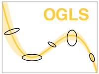

# OGLS

Python library for Omnivariant Generalized Least-Square regression.

## Contact

All questions and suggestions are welcome and should be directed at [Mathieu Daëron](mailto:daeron@lsce.ipsl.fr?subject=[D47calib]), or feel free to open an issue [here](https://github.com/mdaeron/D47calib/issues).

